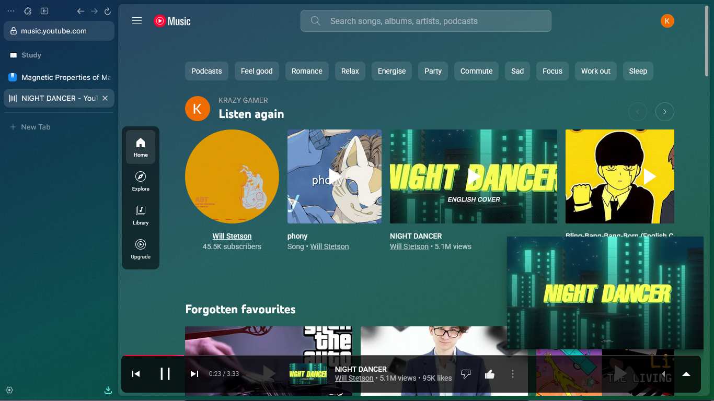
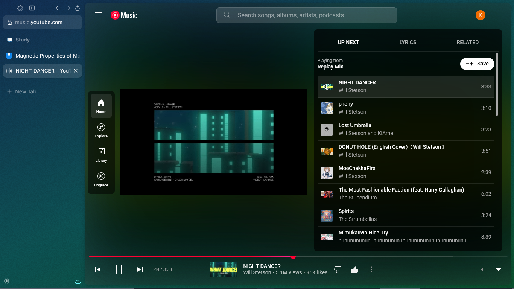
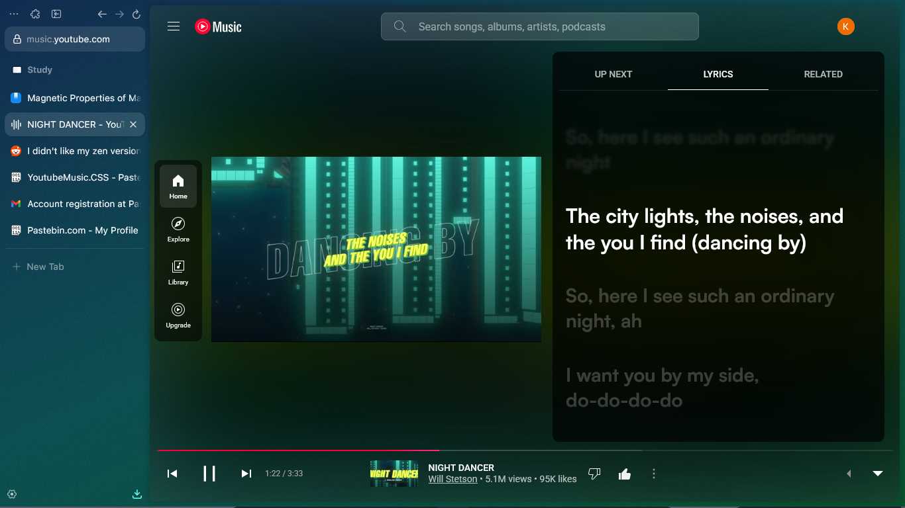
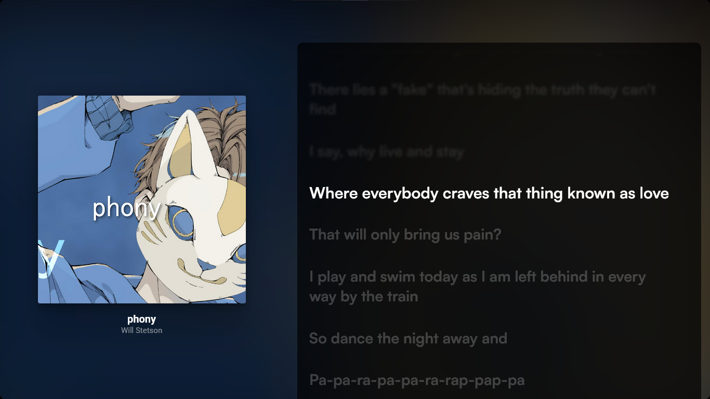
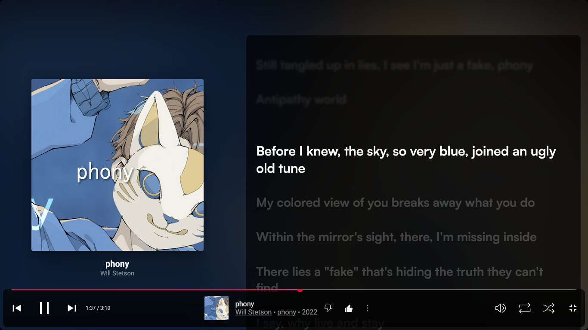

# A Custom CSS for YouTube Music

A cool 😎 CSS for Youtube Music in Zen

## Preview
**Docked NavBar And Floating Player**

**See What's Playing Next**

**Synced Lyrics**

**Full Screen Player with Lyrics**

**Full Screen Player with Controls and Lyrics**

## Installation
* Install [Better-Lyrics](https://addons.mozilla.org/en-US/firefox/addon/better-lyrics/) Addon
* Install CSS Editor like [StyleBot](https://addons.mozilla.org/en-US/firefox/addon/stylebot-web/)
* Open [YouTube Music](https://music.youtube.com)
* Run StyleBot
* 
* Go to Code Section
* 
* Paste the [CSS Code](Youtube-Music.css) in the Code section
* 
* 
* Now You're Done 👍👍

plz star this repo 😖
